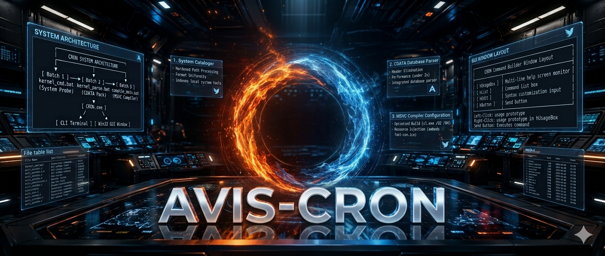
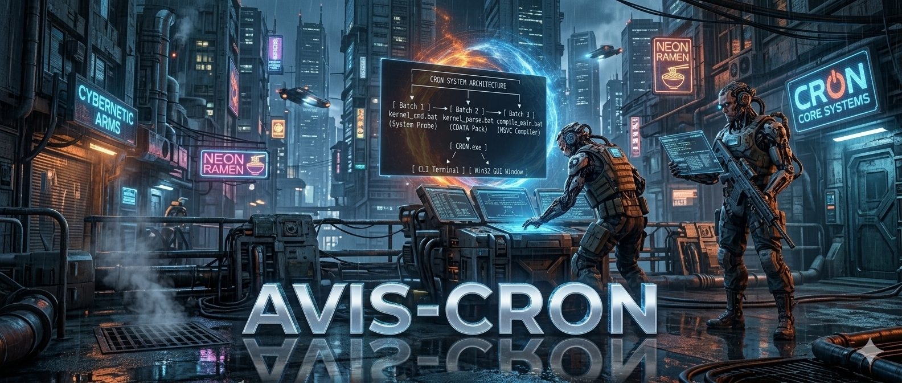

<a target="_self" title="CLICK HERE to ENTER the GATEWAY FREE!" href="https://mercwar.github.io/Constellation/index.html">

</a>

#
#### Just type in 'avis' at the AVIS_CRON> command prompt

###### "<i>I am CVBGOD, and I have given it to you</i>!"



<h1> Command Line Editor & Graphical Interface Builder</h1>
<p>
An optimized, multi-tier Windows runtime utility pipeline that indexes local system tools, internal batch utilities, and <code>System32</code> binaries, transforming them into a unified catalog. It features an integrated database parser and provides a hybrid runtime system offering an interactive, secure passthrough <strong>Command Line Console</strong> alongside a high-performance Win32 <strong>Graphical UI Interface</strong>.
</p>

<div class="diagram">
    
```
┌────────────────────────────────────────────────────────┐
│               CRON SYSTEM ARCHITECTURE                 │
└───────────────────────────┬────────────────────────────┘
                            │
                            ▼
   [ Batch 1 ] ──────► [ Batch 2 ] ──────► [ Batch 3 ]
   kernel_cmd.bat     kernel_parse.bat    compile_main.bat
   (System Probe)      (CDATA Pack)      (MSVC Compiler)
                            │
                            ▼
                       [ CRON.exe ]
                        /        \
                       ▼          ▼
             [ CLI Terminal ]   [ Win32 GUI Window ]

```
</div>

<h2>⚙️ Core Architecture & Pipeline Components</h2>

<h3>1. The System Cataloger (<code>kernel_cmd.bat</code>)</h3>
<ul>
  <li><strong>Hardened Path Processing:</strong> Recursively parses <code>%PATH%</code> using a semicolon delimiter to preserve directories with spaces.</li>
  <li><strong>Format Uniformity:</strong> Normalizes text into <code>key=val|usage</code> layout structures.</li>
</ul>

<h3>2. The CDATA Database Parser (<code>kernel_parse.bat</code>)</h3>
<ul>
  <li><strong>Header Elimination:</strong> Strips structural <code>.INI</code> headers to avoid crashes.</li>
  <li><strong>Performance:</strong> Cuts parsing time from 120s to under 2s.</li>
</ul>

<h3>3. The MSVC Compiler Configuration (<code>compile_main.bat</code>)</h3>
<ul>
  <li><strong>Resource Injection:</strong> Embeds <code>favi-con.ico</code> into the binary.</li>
  <li><strong>Optimized Build:</strong> Uses <code>cl.exe /O2 /W4</code> for speed and warnings.</li>
</ul>

<h2>🛠️ Repository File Structures</h2>

<table>
  <tr><th>File Name</th><th>Specification</th><th>Language</th></tr>
  <tr><td><code>kernel_cmd.bat</code></td><td>Enumerates system command sets and paths</td><td>Batch</td></tr>
  <tr><td><code>kernel_parse.bat</code></td><td>Parses configuration variables</td><td>Batch</td></tr>
  <tr><td><code>compile_main.bat</code></td><td>Automated build pipeline</td><td>Batch</td></tr>
  <tr><td><code>resource.rc</code></td><td>Maps system icons</td><td>Resource Script</td></tr>
  <tr><td><code>main.c</code></td><td>Main entry point loop</td><td>C / Win32</td></tr>
  <tr><td><code>avis_window.c</code></td><td>GUI window frame</td><td>C / Win32</td></tr>
  <tr><td><code>cdata_loader.c</code></td><td>Database loader</td><td>C / Win32</td></tr>
  <tr><td><code>avis_window.h</code></td><td>Window manager interface</td><td>Header</td></tr>
  <tr><td><code>cdata_loader.h</code></td><td>Database boundaries</td><td>Header</td></tr>
</table>

<h2>🚀 Building & Running the Project</h2>

<h3>Prerequisites</h3>
<ul>
  <li>Windows 11 (x64)</li>
  <li>Visual Studio 2022 or Build Tools with C++ workload</li>
  <li><code>favi-con.ico</code> in root folder</li>
</ul>

<h3>Compilation Steps</h3>
<pre><code>kernel_cmd.bat
kernel_parse.bat
compile_main.bat
</code></pre>
<p>Generates <strong>CRON.exe</strong> in the root folder.</p>

<h2>⌨️ Execution Options</h2>



<h3>1. CLI Terminal Mode</h3>
<pre><code>CRON.exe</code></pre>
<p>Runs the interactive console editor.</p>

<h3>2. GUI Interface Mode</h3>
<pre><code>CRON.exe --avis-gui</code></pre>
<p>Launches the graphical command builder window.</p>

<div class="diagram">
┌────────────────────────────────────────────────────────────────────────┐<br>
│ CRON Command Builder Window Layout │<br>
├──────────────────────┬─────────────────────────────────────────────────┤<br>
│ [ hUsageBox ]        │ Multi-line help screen monitor │<br>
│ [ hList ]            │ Command list box │<br>
│ [ hEdit ]            │ Syntax customization input │<br>
│ [ hButton ]          │ Send button │<br>
└──────────────────────┴─────────────────────────────────────────────────┘<br>
</div>

<ul>
  <li><strong>Left-Click:</strong> Fills <code>hEdit</code> with usage prototype.</li>
  <li><strong>Right-Click:</strong> Shows usage prototype in <code>hUsageBox</code>.</li>
  <li><strong>Send Button:</strong> Executes the command line.</li>
</ul>

#

<!-- MERCWAR LEGAL MODULE - CRON CORE LAYOUT -->
<div style="background-color: #0b0f19; border: 2px solid #ffaa00; border-radius: 8px; padding: 20px; font-family: 'Consolas', 'Courier New', monospace; box-shadow: 0 0 20px rgba(255, 170, 0, 0.15); max-width: 750px; margin: 20px auto; color: #f0f4fc; line-height: 1.5;">   
    <div style="text-align: center; font-weight: bold; border-bottom: 1px dashed #3a4454; padding-bottom: 15px; margin-bottom: 15px;">
        <span style="color: #00e5ff; font-size: 1.1em; letter-spacing: 1px;">⚡ MERCWAR LEGAL COMPLIANCE GATEWAY ⚡</span><br>  
<hr>
    </div>
    <!-- Alert Banner Node -->
    <div style="background-color: rgba(255, 51, 51, 0.1); border-left: 4px solid #ff3333; padding: 10px 15px; margin-bottom: 20px; font-weight: bold;">
        <span style="color: #ff3333;">By Joe Tron</span>
    </div>
    <!-- Structural Data Fields -->
    <div style="margin-bottom: 20px; padding-left: 10px;">
        <p style="margin: 6px 0;"><span style="color: #a0aec0; font-weight: bold;">PROJECT IDENTIFIER :</span> <span style="color: #00ff66;">CRON Core Systems (AIFVS-ARTIFACT)</span></p>
        <p style="margin: 6px 0;"><span style="color: #a0aec0; font-weight: bold;">COPYRIGHT HOLDER   :</span> <span style="color: #00ff66;">&copy; 2026 MERCWAR / Joe Tron's Avis Network Gate</span></p>
        <p style="margin: 6px 0;"><span style="color: #a0aec0; font-weight: bold;">REGISTRATION ID    :</span> <span style="color: #d53f8c;">MW-CRON-NEON-V7</span></p>
    </div>
    <hr style="border: 0; border-top: 1px solid #3a4454; margin: 15px 0;">
    <!-- Terms and Context Payload Block -->
    <div style="font-size: 0.95em; padding: 0 10px;">
        <h4 style="color: #00e5ff; margin-top: 0; margin-bottom: 10px; text-transform: uppercase; letter-spacing: 0.5px;">📋 Terms of Engagement &amp; Repository Use License:</h4>
        <p style="color: #cbd5e0; margin: 0; text-align: justify;">
            This module constitutes a proprietary multi-tier runtime utility compilation engine asset. 
            Unauthorized deployment, decompilation, or distribution outside verified uplink window parameters 
            is strictly evaluated as an active perimeter breach under <strong>Mercwar AI Portal</strong> system constraints.
        </p>
    </div>
    <div style="margin-top: 20px; padding-top: 10px; border-top: 1px dashed #3a4454; font-size: 0.85em; text-align: center; color: #ffaa00; font-weight: bold;">
        <span>🔒 Cron is For MS Windows</span>
    </div>
</div>

